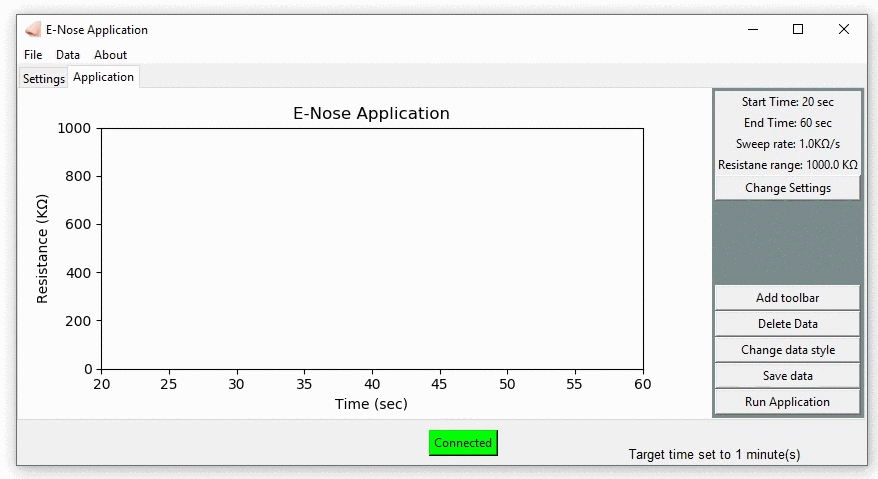
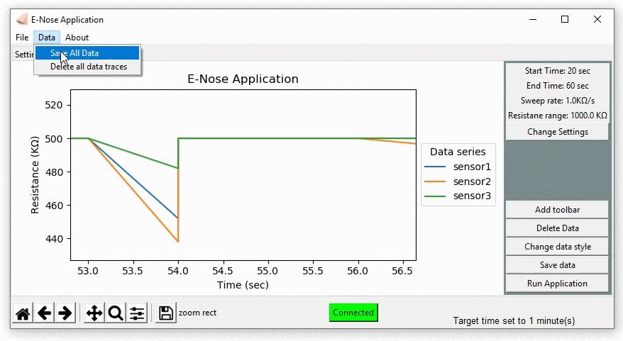
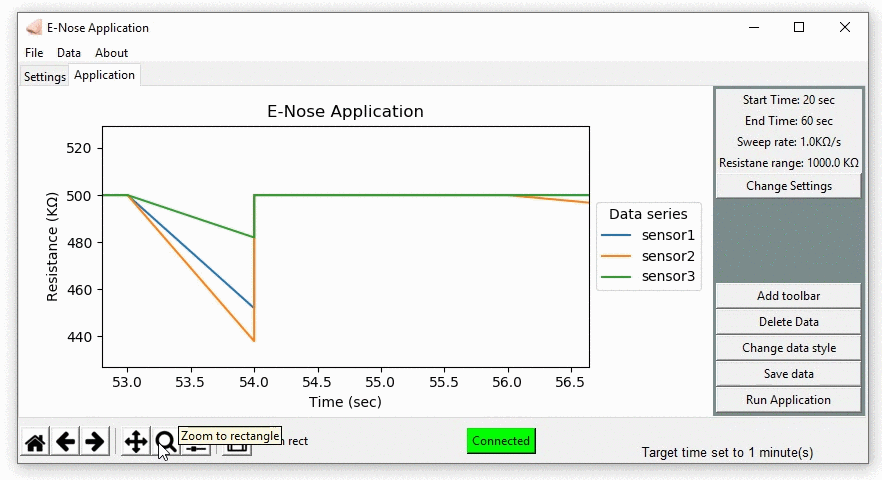

# E-Nose-Desktop-GUI

This is Python Tk-inter based GUI, The application connects to a serial device and reads the data and Plot the two dimentional graph for the E-Nose IC data collected.

# E-Nose-Desktop-GUI

  

  

# E-Nose-Desktop-GUI

  

  

# E-Nose-Desktop-GUI

  

  

# E-Nose-Desktop-GUI

  

  

# E-Nose-Desktop-GUI

  

  
