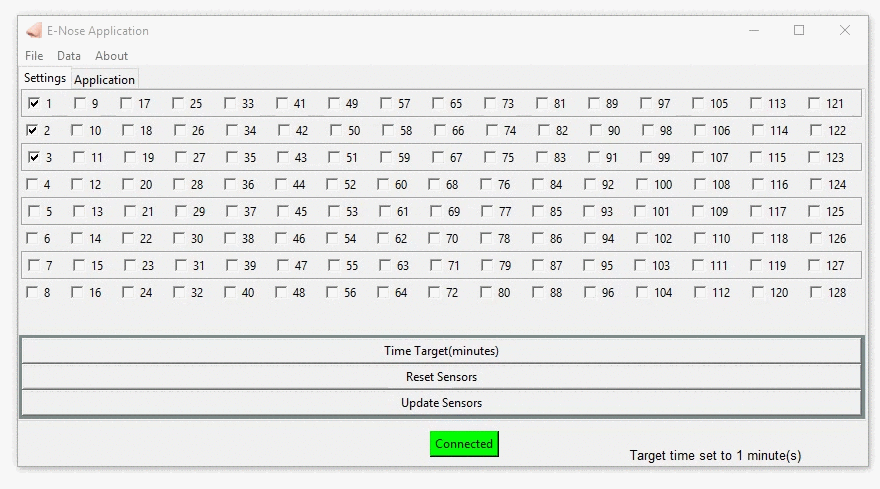

# E-Nose-Desktop-GUI

This is Python Tk-inter based GUI, The application connects to a serial device and reads the data and Plot the two dimentional graph for the E-Nose IC data collected.

Download the Graphical User Interface from the e-nose-desktop-gui repository. You can download the python source files or the executable for Windows machines in the release tab at https://github.com/KarthikGangadhar/e-nose-desktop-gui/releases

The Application is developed using Tk-inter and exported to exe using [pyinstaller](https://www.youtube.com/watch?v=lOIJIk_maO4) with the following command.

```
  pyinstaller -w -F amp_gui.py -i favicon.ico
```


### 1. Setting Time-Target value.

<p align="left">
  
</p>  


### 2. Serial Device Configuration

<p align="left">
  
</p>  


### 3. Graph modifying Tool-bar

<p align="left">
  
</p>  


### 4. Saving data into CSV file.

<p align="left">
  
</p>  


### 5. Altering the graph settings

<p align="left">
  
</p>  

